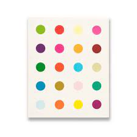

# Hirst Painting Generator: A Dance of Colors! 🎨

Dive into the vivid world of art with the Hirst Painting Generator. Breathe life into your images, transforming them into mesmerizing Hirst-inspired dot paintings. Let every pixel tell its story, every color sing its song!

## Repository URL

Step into our colorful gallery: [Hirst Painting GitHub Repository](https://github.com/j-breedlove/hirst_painting.git)

## Setup: Setting the Stage 🎭

1. **Clone the Canvas**:
   ```bash
   git clone https://github.com/j-breedlove/hirst_painting.git
   ```

2. **Enter the Artist's Studio**:
   ```bash
   cd hirst_painting
   ```

3. **Prep Your Palette**:
   ```bash
   pipenv install
   ```

## Painting Your Masterpiece 🖌️

1. **Extract the Essence**: Unearth the dominant hues of your `image.jpeg` and let them be your muse:
   ```bash
   pipenv run python extract_colors.py
   ```

2. **Craft Your Creation**: Paint with the colors you've extracted, or be bold and curate your own palette! Modify the `color_list` variable in `main.py` with your chosen symphony of colors.

3. **Unleash Your Artistry**:
   ```bash
   pipenv run python main.py
   ```

## Personalizing Your Painting 🌈

- **Your Colors, Your Narrative**: Infuse your personality by adjusting the `color_list` in `main.py` with your bespoke palette.
- **Tweak to Perfection**: Modify parameters like `num_rows`, `num_columns`, `circle_radius`, etc., in the `draw_grid` function call within `main.py` to give your masterpiece the perfect finishing touch!
